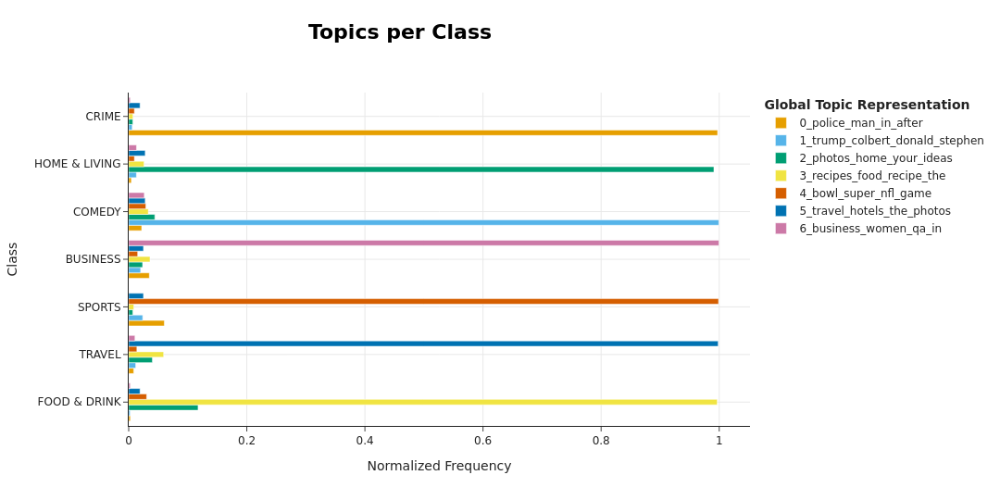
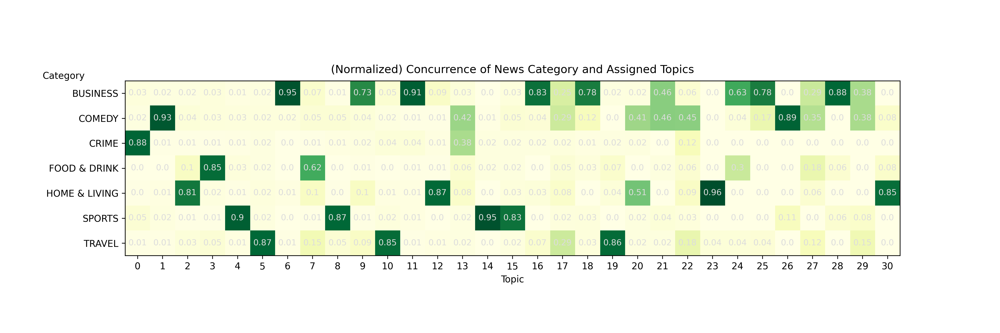

# Language Analytics // Assignment 04
**Topic analysis with BERTopic**

> Daniel Lundgaard (202004134@post.au.dk)
> 21 April 2025

This repo concerns topic modeling upon 14000 Huffington Post news headlines, a subset of the News Category Dataset[^1][^2]. This submission aims to assess the efficacy of the BERTopic[^3] topic modelling tool in extracting semantic themes from news articles.

## How to run

Place the `News_Category_Dataset_v3_subset.jsonl` data file in `data/`.

`run.sh` executes `src/demo.py` which showcases functionality defined in `src/lib.py`.

```console
$ source setup.sh # set up and activate virtual environment, install dependencies
[SUCCESS] setup completed
$ source run.sh # run demonstration code
[...]
```

## Implementation details

A `BERTopic` model was initialized and fitted to the dataset. 
`zeroshot_min_similarity` was set to 0.8 to increase confidence threshold for topic assignment while HBDSCAN was used to automatically reduce the numerousness of topics created. 
This resulted in 104 initial topics, which was then reduced to 32 (using agglomerative clustering on the cosine distance matrix of the topic embedding) in order to facilitate visualization and interpretability. 

## Summary of observations

>
>_Looking at the distribution of assigned topic per category for just the seven first topics, we find that each of these topics clearly tracks one of the seven corresponding news categories. The only caveat is the `FOOD & DRINK` category, where there is some degree of confounding between the dominant topic and the topic tracking `HOME & LIVING`._

>
>_If we look at a heatmap depicting relative frequency betwen each category and topic (normalized by category), we find that, in addition to the seven first topics, there are several other topics closely aligning with the news category. Notable mentions are `BUSINESS`, where also topics 9, 11, 16, 18, 25 and 28 were assigned to documents of the `BUSINESS` category more than 2/3 of the time; `HOME & LIVING` where topics 12, 23 and 30 passed that threshold; `SPORT` where also topics 8, 14 and 15 did_.

```
BUSINESS was associated with topics
   6: business, women, qa, in, marketing, the, founder, oil, and, of
   9: 247, friday, st, wall, black, cities, states, jobs, most, the
  11: mortgage, bank, verizon, banks, trading, loans, yahoo, fargo, wells, bankruptcy
  16: uber, tesla, car, cars, selfdriving, elon, ubers, emissions, electric, drivers
  18: tax, taxes, obamacare, millennials, care, irs, health, is, boomers, millennial
  25: boss, rsum, bosses, job, resume, your, how, tell, bad, references
  28: greece, crisis, euro, greek, european, eurozone, bank, austerity, debt, central

COMEDY was associated with topics
   1: trump, colbert, donald, stephen, jimmy, snl, trumps, bill, maher, trevor
  26: corden, james, cordens, niall, horan, cranston, bryan, euphemism, mcilroys, directions

CRIME was associated with topics
   0: police, man, in, after, shooting, of, cops, killed, accused, arrested

FOOD & DRINK was associated with topics
   3: recipes, food, recipe, the, chocolate, huffpost, photos, to, and, cream

HOME & LIVING was associated with topics
   2: photos, home, your, ideas, to, clean, diy, how, house, day
  12: vintage, ebay, roundup, weekly, finds, country, home, craigslist, appraises, photos
  23: sprout, plant, week, home, of, inspiration, the, flowers, plants, tree
  30: mattress, beds, sleep, guide, buying, rest, bed, photos, mattresses, fourposter

SPORTS was associated with topics
   4: bowl, super, nfl, game, the, nba, to, series, tiger, lebron
   8: olympics, olympic, gold, medal, rio, winter, doping, wins, russian, us
  14: cup, goal, world, soccer, fifa, live, goals, watch, messi, vs
  15: serena, williams, ronda, ufc, rousey, novak, djokovic, floyd, open, wimbledon

TRAVEL was associated with topics
   5: travel, hotels, the, photos, hotel, to, in, cruise, best, of
  10: airlines, flight, plane, airline, tsa, air, airplane, passengers, seat, attendant
  19: paris, italy, rome, in, le, venice, great, hours, marais, italian
```

### References

[^1] Misra, R. (2022). News Category Dataset (No. arXiv:2209.11429). arXiv. https://doi.org/10.48550/arXiv.2209.11429

[^2] Misra, R., & Grover, J. (2021). Sculpting Data for ML: The first act of Machine Learning.

[^3] Grootendorst, M. (2022). BERTopic: Neural topic modeling with a class-based TF-IDF procedure (No. arXiv:2203.05794). arXiv. https://doi.org/10.48550/arXiv.2203.05794